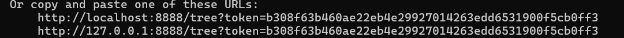
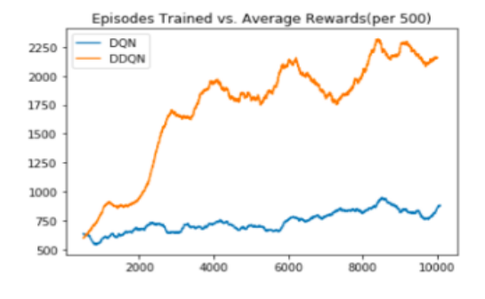
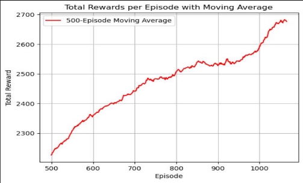

There are two ways to run our code and simulate our results:

**WAY 1: USING DOCKER:**

Note: Make sure your docker desktop is open when you run the below commands in command prompt to not face any errors. If docker desktop is not installed, please install it first and then run the below commands.

1. Open Command Prompt on windows
1. Docker login: 

**docker login**

3. Pull the docker image from vijaydevmasters docker hub account using:

**docker pull vijaydevmasters/mario\_690\_v2:best**

4. Run the docker image:

**docker run --gpus all -p 8888:8888 vijaydevmasters/mario\_690\_v2:best**

After running the image on one of the links generated ***ctrl + right\_click***. This will take you to server that has “690\_final\_project.ipynb” file. 

Now open “690\_final\_project.ipynb” file and run the cells. Take note of markdown cells (that are at the very end of the 690\_final\_project.ipynb file) that explain what cell to run to recreate the simulation using our trained model, or to train our model more, or to train the model from scratch.

Results:

- The graph depicts the performance of a basic convolutional neural network (CNN) in blue for DQN and in orange for DDQN.
- The performance of both models shows that while DDQN outperforms the basic DQN,  both  models  using  a  straightforward  CNN  architecture  demonstrate significant fluctuations in learning. This is typical for basic CNNs, which might struggle with the complexities of a dynamic environment like 'Super Mario Bros' due to their limited ability to capture higher-order dependencies and contextual information.

- This model integrates ResNet-18, known for its deep residual learning framework which helps in avoiding the vanishing gradient problem, thereby allowing it to learn more effectively from complex visual inputs.
- Additionally, the inclusion of the Swin Transformer, which focuses on hierarchical feature processing with its shifted windowing scheme, offers enhanced modeling of spatial hierarchies, making it well-suited for video game environments where understanding spatial relationships is crucial.
- The second graph showcases a consistent and pronounced upward trajectory in the total rewards per episode, indicating that the combined strengths of ResNet- 18 and Swin Transformer significantly enhance the model’s ability to learn and adapt. The smooth and continuous increase in the moving average indicates robust learning and effective optimization over time.

- The second graph’s model, featuring ResNet-18 and Swin Transformer, clearly exhibits superior learning capabilities compared to the first graph’s basic CNN model.  This  is  evident  from  the  higher  and  more  consistent  reward  values, suggesting that the advanced model can more effectively interpret and respond to the game’s dynamics.
- The architectural advancements in the second model likely provide a deeper understanding and better generalization, which are critical in environments with complex and variable patterns like video games.
- The resilience and efficiency of the ResNet-18 with Swin Transformer configuration contribute to more stable and accelerated learning curves, minimizing fluctuations and enabling the model to exploit learned strategies more effectively.

Simulation Videos:

Model trained for 700 episodes: 

[https://drive.google.com/file/d/1q_OZU22sIyUM6BQMdHATeNEbEZeEt5J2/view?usp=s haring](https://drive.google.com/file/d/1q_OZU22sIyUM6BQMdHATeNEbEZeEt5J2/view?usp=sharing) 

Model trained for 1250 episodes: 

[https://drive.google.com/file/d/1sDmT4OxLW16u8LjSfMeDprTD4lfKdk6R/view?usp=sha ring](https://drive.google.com/file/d/1sDmT4OxLW16u8LjSfMeDprTD4lfKdk6R/view?usp=sharing) 

I have also submitted these video files on canvas.

Pipeline of the project:

**Frame Preprocessing and Data Management**: The initial stage involved the meticulous preprocessing of input frames from 'Super Mario Bros' and effective management of stored data. This step was crucial to ensure that the input fed into the neural network was optimized for quick and effective learning. Techniques such as frame skipping, grayscale conversion,  image  downscaling,  format  adjustment,  and  normalization  (discussed previously) were applied. These preprocessing steps ensured that the neural network received clean, relevant, and simplified data, aiding in better and faster learning.

**Model  Architecture  and  Training**:  A  Double  Deep  Q-Network  (Double  DQN)  was employed, leveraging a novel convolutional neural network (CNN) architecture. This architecture was designed to reduce the overestimation of action values, a common problem with standard DQN models. To enhance the learning capabilities of our model, we  integrated  a  pretrained  ResNet  model  with  a  Swin  Vision  Transformer  (Swin Transformer).  The  hybrid  approach  combined  ResNet’s  robust  feature  extraction capabilities  with  Swin  Transformer’s  efficiency  in  processing  sequential  data.  This synergy was expected to improve the model’s ability to generalize from the visual input to effective gameplay strategies.

**Training  and  Performance  Evaluation**:  The  training  process  involved  running numerous episodes, where the model continuously learned from the gameplay, adjusting its strategies based on the reward outcomes. Remarkably, the model’s performance exceeded our initial expectations, showing exceptional results in terms of gameplay strategy and decision-making compared to other models found online.

**Documentation  and  Resources**:  To  facilitate  reproducibility  and  further experimentation, I have included the Jupyter notebook "690\_final\_project.ipynb" in our project repository. This notebook encompasses the entire process from initializing the environment  and  preprocessing  the  frames  to  training  the  model  and  evaluating  its performance. For a practical demonstration, a video accompanying the notebook, titled "simulation.mp4", has been provided. This video showcases the trained agent playing 'Super  Mario  Bros',  illustrating  the  effectiveness  of  the  implemented  strategies. Additionally, an image named "graph.png" has been attached to visually represent the progress of the model over time. This graph plots the weighted average reward per 500 episodes against the episode number, offering a quantitative measure of the model’s learning and performance across episodes.

Overview of the code:

- **Environment Setup**: We initiated the environment 'SuperMarioBros-v0', defining both  the  action  space  and  observation  space.  The  observation  space characterizes the environment dynamics and the agent's perspective, capturing the necessary parameters for the agent's decision-making process.
- **Action Space Reduction**: The default action space, originally comprising 256 possible actions, was significantly reduced to five. This simplification is strategic, aiming to streamline the decision-making process for the Deep Q-Network (DQN). By limiting the complexity of actions, the DQN can learn more efficiently and effectively, enhancing its performance in navigating the game.
- **Environment Wrapping with Customized Functions**: To further optimize the learning process, we introduced several wrappers that preprocess and manage the state data:
- max\_skip\_environment Wrapper: This wrapper addresses the challenge of handling  a  high-frequency  decision-making  environment  by  skipping  a specified number of frames during the agent's training process. In practice, while the agent only makes a decision at each interval, every skipped frame is  still  returned  and  can  be  observed  by  the  agent.  This  reduces  the computational demand by decreasing the number of times the agent needs to evaluate the environment and decide on an action. The idea is to make the problem more tractable by focusing on pivotal frames where significant changes occur, thus speeding up the training without losing critical temporal information.
- frames\_64 Wrapper: The purpose of this wrapper is to preprocess the visual input from the game. It converts color frames to grayscale, which reduces the complexity of the input data, as color information is often superfluous for  learning  effective  policies.  Additionally,  it  downscales  the  image resolution to 84x84 pixels. This drastic reduction in pixel count lowers the input dimensionality significantly, making it easier for the neural network to process the data. This not only speeds up the computation during the forward and backward passes of network training but also helps in focusing on the essential structural elements of the frame without getting distracted by detailed textures or color variations.
- Pytorch\_img Wrapper: This wrapper reformats the image data to fit the expected  input  structure  of  PyTorch's  convolutional  neural  networks (CNNs). PyTorch CNNs prefer input in the format of Channels x Height x Width  (CHW),  whereas  typical  image  formats  are  in  Height  x  Width  x Channels (HWC). This reformatting is critical because it aligns with how PyTorch  handles  and  processes  image  data  efficiently,  allowing  for optimized tensor operations that are fundamental to training deep learning models.
- Scale\_frame Wrapper: Normalization of pixel values is performed by this wrapper,  scaling  the  range  from  0-255  (typical  for  RGB  images)  to  a floating-point range between 0 and 1. This scaling is crucial for neural network models as it helps in maintaining numerical stability, providing a common  scale  for  input  features,  and  often  leading  to  much  faster convergence during training.
- buffer\_wrapper:  This  wrapper  creates  a  temporal  buffer  that  stores  a sequence of the last 'n' observations, where 'n' typically depends on the specific requirements of the task. For dynamic environments like video games,  capturing  temporal  dynamics  is  essential  for  understanding environmental changes over time. By storing multiple past frames, the buffer  provides  the  DQN  with  a  more  comprehensive  view  of  the environment's state, including motion clues and changes that occur over these frames. This is particularly useful for tasks where the future state is highly dependent on past actions and outcomes, as it allows the DQN to make predictions based on a richer contextual background.
- **Output Environment Configuration:** The observation space is enriched by the BufferWrapper, configured to retain the last four observations. Each observation, once  processed  through  the  ImageToPyTorch  wrapper,  has  dimensions  of 1x64x64. These frames are concatenated along a new dimension, resulting in a comprehensive  observation  space  of  4x64x64.  This  configuration  provides  a robust spatial and temporal input structure, enabling the agent to make more informed decisions based on both current and past environmental states.

Novelty of our Neural Network:

To enhance the training efficiency and effectiveness of our Double DQN architecture in the 'Super Mario Bros' environment, we strategically incorporated the ResNet-18 model and the Swin Transformer. Here's an elaboration on how these components synergize to boost performance:

- ResNet-18 Integration:

ResNet,  short  for  Residual  Network,  introduces  a  novel  architectural innovation called skip connections, or shortcut connections, which allow the gradient to flow through the network without passing through non-linear activations. This design mitigates the vanishing gradient problem, enabling deeper networks to train effectively. ResNet-18, a variant with 18 layers, provides  a  robust  feature  extraction  capability  while  being  relatively lightweight compared to deeper versions like ResNet-34 or ResNet-50. By using a pretrained ResNet-18, our model leverages learned features from vast and diverse datasets (like ImageNet), which are highly effective for general visual recognition tasks. This pretraining helps the model to quickly adapt to the visual patterns in 'Super Mario Bros', significantly reducing the amount of time required for feature learning from scratch.

- Swin Transformer Application:

The Swin Transformer, a type of Vision Transformer (ViT), is tailored for efficient performance on tasks requiring detailed understanding of spatial hierarchies in images. Unlike traditional transformers, which treat an image as a sequence of pixels, the Swin Transformer operates on windows of images,  allowing  it  to  model  local  interactions  before  integrating  them hierarchically.  This  hierarchical  design  is  particularly  advantageous  for complex visual environments like video games, where understanding both local details and global context (such as obstacles and enemies in 'Super Mario Bros') is crucial. The Swin Transformer's ability to dynamically adjust its focus on different parts of an image makes it highly effective for the dynamic scenes encountered in gameplay.

- Synergistic Effects:

When  combined,  ResNet-18  and  Swin  Transformer  complement  each other’s  strengths,  creating  a  powerful  hybrid  model.  ResNet-18  rapidly extracts essential features through its deep residual layers, while the Swin Transformer enhances the model’s capacity to attend to various spatial features  and  their  interactions  over  time.  This  dual  approach  not  only accelerates the learning process but also enhances the model’s ability to 

generalize from the game’s visual input to effective action choices.

- Advantages Over Other Models:

This architecture stands out from typical models found on the internet in several  ways.  First,  it  significantly  speeds  up  the  learning  process  by utilizing advanced feature extraction and attention mechanisms, allowing the model to quickly understand and adapt to new environments. Second, it improves the quality of the learned policies, as it can capture complex dependencies in the input data that simpler models may overlook. Lastly, the use of a pretrained network reduces the need for extensive training data 

from the game itself, making the model efficient in terms of both time and computational resources.

This combination of advanced neural network architectures not only results in faster training  times  compared  to  other  models  but  also  in  a  more  robust  and  adaptable gameplay strategy, as demonstrated in our project outcomes.
